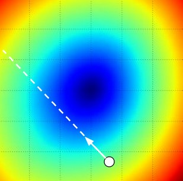

Welcome to the second session of Deep Learning in Raspberry Pi.

In this section, we are going to discuss some core concepts in Machine
Learning (ML). We will dive into two historically very influential learning models: Linear Regression and Logistic Regression. We will also discuss Stochastic Gradient Descent (SGD) and its variants. 

## What is a "Learning Algorithm"?

A broadly adopted definition of the _learning algorithm_ is given by Tom M. Mitchell in his classical book _Machine Learning_ in 1997:

---

"A computer program is said to __learn__ from

+   experience $$E$$ with respect to
+   some class of tasks $$T$$ and
+   performance measure $$P$$,

if its performance at tasks in $$T$$, as measured by $$P$$, improves with experience $$E$$" (Mitchell, 1997)

---

__Remark__: This book is enjoyable to read and introduced many ML algorithms that were very popular back then. It reflects how researchers thought and did in the 1980s and 1990s.

Many popular machine learning textbooks have in-depth discussions of this
definition (Mitchell, 1997; Murphy, 2012; Goodfellow et al., 2016).

### The task $$T$$

The task $$T$$ is usually a specific problem that cannot be easily solved by conventional methods (e.g, array sorting problem can be easily solved by using quick sort). Here we provide some canonical examples of Machine Learning tasks:

+ __Classification__ specifies which $$k$$ categories some input belongs to. ($$f:\mathbb{R}^{n}\rightarrow\{1,\ldots, K\}$$)

+ __Regression__ predicts a numerical value given some input. ($$f: \mathbb{R}^{n}\rightarrow\mathbb{R}$$)

+ __Transcription__ outputs a sequence of symbols, rather than a category code. (similar to classification, e.g., speech recognition, machine translation, image captioning)

+ __Denoising__ predicts clean samples $$\mathbf{x}$$ from _corrupted_ samples $$\tilde{\mathbf{x}}$$. (estimate $$\Pr(\mathbf{x}\vert\tilde{\mathbf{x}})$$)

### The performance measure $$P$$

The performance measure $$P$$ is usually specific to the task $$T$$ (e.g. accuracy to classification). Unlike optimization, the learning algorithm is evaluated based on _previously unseen_ data. We often have a set of _validation_ data to conduct this evaluation. The design of a measure $$P$$ can be very subtle. The measure should be effective so that we can anticipate how well the learning algorithm would perform after deployment.

### The experience $$E$$

Experience is what learning algorithms are allowed to have during learning process. The experience is usually an _dataset_ that is a collection of _examples_. Normally, we call this dataset as the _training dataset_. Here we give the structure of the training dataset to Unsupervised Learning and Supervised Learning algorithms.

+ _Unsupervised Learning algorithms_ experience a dataset containing many features, learning useful structure of the dataset (estimate $$\Pr(\mathbf{x})$$).

+ _Supervised Learning algorithms_ experience a dataset containing features, but each example is also associated with a _label_ or _target_ (estimate $$\Pr(\mathbf{y}\vert\mathbf{x})$$).

__Remark__: In most real world cases, we would not have the access to the _testing dataset_ and the _validation dataset_. In the absence of the _validation dataset_, we usually split 20% of the training dataset to be the _validation dataset_.

### Hypothesis function

Mathematically, this computer program with respect to the learning task $$T$$ can be defined
as a hypothesis function that takes an input $$\mathbf{x}$$ and transforms it to
an output $$\mathbf{y}$$.

$$\mathbf{y}=f(\mathbf{x}; \mathbf{W})$$

The function may be parameterized by a group of parameters $$\mathbf{W}$$.
Note that $$\mathbf{W}$$ includes both trainable and non-trainable parameters.
All the DNN architectures discussed in this module can be formulated in this paradigm.

Strictly speaking, the hypothesis function defines a large family of functions that could be the solution to the task $$T$$. At the end of training, the hypothesis function is expected to be parameterized by a set of optimal parameters $$\mathbf{W}^{\star}$$ that yields the highest performance according to the performance measure $$P$$ of the given task.

### The Cost Function

A cost function $$J$$ is selected according to the objective(s) of the hypothesis function in which it defines the constraints. The cost function is minimized during the training so that the hypothesis function can be optimized and exhibits the desired behaviors (e.g., classify images, predict houshold value, text-to-speech). The cost function reflects the performance measure $$P$$ directly or indirectly. In most cases, the performance of a learning algorithm gets higher
when the cost function $$J$$ becomes lower.

When the cost function is differentiable (such as in DNNs presented in this module), a class of _Gradient-Based Optimization_ algorithms can be applied to minimize the cost function $$J$$. Thanks to specialized hardware such as GPUs and TPUs, these algorithms can be computed very efficiently.

Particularly, Gradient Descent (Cauchy, 1847) and its variants, such as
RMSprop (Tieleman & Hinton, 2012), Adagrad (Duchi et al., 2011), Adadelta
(Zeiler, 2012), Adam (Kingma & Ba, 2014) are surprisingly good at training
Deep Learning models and have dominated the development of training algorithms. Software libraries such as `Theano` (Theano Development Team, 2016)
and `TensorFlow` (Abadi et al., 2015) have automated the process of computing the gradient (the most difficult part of applying gradient descent) using
a symbolic computation graph. This automation enables the researchers to
design and train arbitrary learning models.

__Remark__: in this module, we use the term "cost function", "objective function" and "loss function" interchangeably. Usually, the loss function is denoted as $$\mathcal{L}$$.

We will revisit this topic at the end of this session. In next sections, we will look closely into __Linear Regression__ (Regression) and __Logistic Regression__ (Classification).

## Linear Regression

Regression is a task of Supervised Learning. The goal is to take a input vector $$\mathbf{x}\in\mathbb{R}^{n}$$ (a.k.a, features) and predict a target value $$y\in\mathbb{R}$$. In this section, we will learn how to implement _Linear Regression_.

As the name suggested, Linear Regression has a hypothesis function that is a linear function. The goal is to find a linear relationship between the input features and the target value:

$$
\begin{aligned}
y^{(i)}=f(\mathbf{x}^{(i)};\{\mathbf{W}, b\})=&w_{1}\cdot x_{1}+w_{2}\cdot x_{2}+\ldots+w_{i}\cdot x_{i}+\ldots+w_{n}\cdot x_{n}+b \\
=&\sum_{i=1}^{n}w_{i}\cdot x_{i}+b = \mathbf{W}^{\top}\mathbf{x}^{(i)}+b
\end{aligned}
$$

Note that $$\{\mathbf{x}^{(i)}, y^{(i)}\}$$ is the $$i$$-th sample in the dataset $$\{\mathcal{X}, \mathbf{y}\}$$ that has $$N$$ data points. The parameters $$\theta=\{\mathbf{W}, b\}$$ consists of weights $$\mathbf{W}$$ and a bias $$b$$.

Suppose that the target value is a scalar (a.k.a $$y^{(i)}\in\mathbb{R}$$), we can easily define such model in Keras:

```python
x = Input((10,), name="input layer")  # the input feature has 10 values
y = Linear(1, name="linear layer")  # implement linear function
model = Model(x, y)  # compile the hypothesis function
```

To find a linear relationship that has $$y^{(i)}\approx f(\mathbf{x}^{(i)};\theta)$$, we need to find a set of parameters $$\theta^{\star}$$ from the parameter space $$\theta$$ where the optimized function $$f(\mathbf{x};\theta^{\star})$$ generate least error as possible. Suppose we have a cost function $$J$$ that measures the error made by the hypothesis function, our goal can be formulated into:

$$
\theta^{\star}=\arg\min_{\theta}J(\theta)
$$

For Linear Regression, one possible formulation of the cost function is Mean-Squared Error (MSE), this cost function measures the mean error caused by each data sample:

$$
J(\theta)=\frac{1}{N}\sum_{i=1}^{N}\left(y^{(i)}-f(\mathbf{x}^{(i)};\theta)\right)^{2}
$$

By minimizing this cost function via training algorithm such as Stochastic Gradient Descent (SGD), we hope that the trained model $$f(\mathbf{x}; \theta^{\star})$$ can perform well on unseen examples in the testing dataset.

__Remark__: there are other cost functions for regression tasks, such as Mean Absolute Error (MAE) and Root-Mean-Square Error (RMSE). Interested readers are encouraged to find out what they are.

__Remark__: Linear Regression is a class of learning model that are extensively studied in history.

__Remark__: The math in this module choses to use a column-vector based system, which means each vector is assumed to be a column vector. This convention is also applied by many books and tutorials. However, in practice, most `ndarray` packages use the row-vector based system because the first dimension of a multi-dimensional array is for row. For example,

```python
A = np.array([1, 2, 3, 4, 5])
```

The array `A` is actually a row vector. We assume that the readers know this fact and can modify the code accordingly.

## Logistic Regression

In this section, we discuss the solution to another Supervised Learning task - _Binary Classification_. Instead of predicting continuous values (e.g., how many pairs of shoes you have), we will wish to make a decision whether the input feature $$\mathbf{x}$$ belongs to some category. And in the case of Binary Classification, we have only two classes (e.g., to be or not to be, shoe or skirt). And _Logistic Regression_ is a simple learning algorithm that solves this kind of tasks.

Suppose our input feature $$\mathbf{x}$$ is a $$n$$-dimensional vector and the output class label $$y\in\{0, 1\}$$ (0 and 1 are abstract labels, we can associate meanings for these labels, such as 0 is shoe and 1 is skirt). The Logistic Regression constructs a hypothesis function that assign the probability that $$\mathbf{x}$$ belongs to the class $$y=1$$. Specifically, the Logistic Regression uses the "logistic function":

$$
\sigma(\mathbf{x}; \theta) = \frac{1}{1+\exp(-(\mathbf{W}^{\top}\mathbf{x}+b))}
$$

<hr>
<div align="center">

<p>The logistic function.</p>
</div>
<hr>

Commonly, we use the symbol $$\sigma(\cdot)$$ to represent the logistic function. Furthermore, $$\sigma(\cdot)$$ is often called the "sigmoid" function as well. The logistic function has a nice property where it can map the input $$\mathbf{W}^{\top}\mathbf{x}+b$$ into the range $$(0, 1)$$ so that we can interpret the output of this function as probability:

$$
\begin{aligned}
\Pr(y=1|\mathbf{x}) =& \sigma(\mathbf{x}; \theta) \\
\Pr(y=0|\mathbf{x}) =& 1-\sigma(\mathbf{x}; \theta)
\end{aligned}
$$

Now, we need to design the cost function. A desired function for measuring the quality of the prediction is _binary cross-entropy_:

$$
J(\theta) = -\frac{1}{N}\sum_{i=1}^{N}\left(y^{(i)} \log(\Pr(y=1|\mathbf{x}^{(i)}))+(1-y^{(i)})\log(\Pr(y=0|\mathbf{x}^{(i)}))\right)
$$

Intuitively, when the model makes a correct decision (suppose the true label is 1), then the $$\Pr(y=1|\mathbf{x})$$ is also high, this generates a lower cost when the model makes a wrong decision and the $$\Pr(y=1|\mathbf{x})$$ is low. From the information theory point of view, the _cross-entropy_ between a "true" distribution $$p$$ and a estimated distribution $$q$$ measures the "similarity" between two distributions. Ideally, when the number of sample $$N\rightarrow\infty$$
and cost function $$J(\theta)$$ is 0, we cannot distinguish the estimation distribution from the "true" distribution.

Our optimization algorithm is expected to find a best set of parameters that minimizes the cost function $$J(\theta)$$:

$$
\theta^{\star}=\arg\min_{\theta}J(\theta)
$$

Note that there is a close tie between the Logistic Regression and the Linear Regression. The Logistic Regression is nothing but adding a non-linear function on the top of the linear function. Here is an example of logistic regression in Keras:

```python
x = Input((10,), name="input_layer")
y = Linear(1, name="linear layer")
y = Activation("sigmoid")
model = Model(x, y)
```

Logistic Regression is designed to solve Binary Classification tasks. However, the above formulation can be generalized to solve Multi-class Classification tasks. The following equation defines the hypothesis function for _Softmax Regression_:

$$
\text{softmax}(\mathbf{x})=\Pr(y=k|\mathbf{x}, \theta) = \frac{\exp(\mathbf{W}^{k\top}\mathbf{x}+b_{k})}{\sum_{j=1}^{K}\exp(\mathbf{W}^{(j)\top}\mathbf{x}+b_{k})}
$$

where $$\mathbf{W}^{k}$$ is the $$k$$-th column of a weight matrix $$\mathbf{W}\in\mathbb{R}^{n\times k}$$ and $$b_{k}$$ is the corresponding bias value.

The cost function is defined with _categorical cross-entropy_ function:

$$
J(\theta) = -\frac{1}{N}\sum_{i=1}^{N}\sum_{k=1}^{K}\mathbf{1}\{y^{(i)}=k\}\log\Pr(y^{(i)}=k|\mathbf{x}^{(i)}, \theta)
$$

$$\mathbf{1}\{\cdot\}$$ is the "indicator function" so that $$\mathbf{1}\{\text{a true statement}\}=1$$ and $$0$$ otherwise.

Note that we do not explain this loss function here in detail. The _Deep Learning_ book has a very nice explanation over Softmax function in [Section 6.2.2.3](http://www.deeplearningbook.org/contents/mlp.html).

The optimization algorithm finds a set of parameters $$\theta^{\star}$$ that minimizes the cost function:

$$
\theta^{\star}=\arg\min_{\theta}J(\theta)
$$

Here is a Keras Example

```python
x = Input((10,), name="input_layer")
y = Linear(5, name="linear layer")  # suppose there are 5 classes
y = Activation("softmax")
model = Model(x, y)
```

__Remark__: we will revisit the logistic function in the session 3 when we introduce the first neural network model: Multi-layer Perceptron.

## Stochastic Gradient Descent and its variants

Previous sections define the learning models for Regression and Binary Classification tasks. We now need a training algorithm that minimizes the cost function defined in above sections. In this section, we introduce the most popular set of _Gradient-based Optimization_ algorithms -- Stochastic Gradient Descent (SGD) and its variants.

Almost all modern deep neural networks are trained by the variants of SGD. In some particular cases, there are deep learning models are trained with second-order gradient based methods (e.g., Hessian optimization).

To describe SGD, we first need to understand its parent method - Gradient Descent.

$$\hat{\theta}=\theta-\alpha\frac{\partial J(\theta)}{\partial \theta}$$

<hr>
<div align="center">

<p>Visualizing the effect of step size. Image credit: <a href="http://cs231n.github.io/optimization-1/">CS231n</a></p>
</div>
<hr>

### Momentum SGD

$$
\begin{aligned}
\hat{\mathbf{v}}=&\mu\mathbf{v}-\alpha\nabla J(\theta) \\
\hat{\theta}=&\theta+\hat{\mathbf{v}}
\end{aligned}
$$

### Nesterov's accelerated SGD

$$
\begin{aligned}
\hat{\mathbf{v}} =& \mu\mathbf{v}-\alpha\nabla J(\theta+\mu\mathbf{v}) \\
\theta =& \theta+\hat{\mathbf{v}}
\end{aligned}
$$

### Adaptive SGD

Choosing learning rate $$\alpha$$ for SGD is mainly empirical. Therefore, we will have to perform a manual search from a list of possible learning rates. This process is usually very expensive and time-consuming. In recent years, researchers developed a set of SGD variants that adjust the learning rate $$\alpha$$ automatically.

The notable examples are RMSprop (Tieleman & Hinton, 2012), Adagrad (Duchi et al., 2011), Adadelta (Zeiler, 2012), Adam (Kingma & Ba, 2014).

Note that motivation of having these different variants is not entirely because of the dissatisfaction of the SGD and brute-force search for the learning rate. For example, RMSprop is proposed to deal with _the vanishing gradient problem_ where some very deep networks cannot be trained with standard SGD.

Empirically, one should use Adam optimizer as a start point.


<hr>
<div align="center">
    <p>
    </p>
    <p>Comparing different gradient optimization methods. Image credit: <a href="https://twitter.com/alecrad">Alec Radford</a></p>
</div>
<hr>

### Learning Rate Scheduling

Above sections discuss the methods that have a fixed initial learning rate. The learning rate is either static or adjusted by the training algorithm itself. Recent research suggested that instead of using these optimizers, it is better to schedule the learning rate throughout the training. Normally, this involves even more expensive parameter searching because the researcher has to predefine the "schedule" of the use of learning rate at different stage of training.

We do not discuss this in detail since this is out of scope of this module.

__Remark__: SGD and its variants represent the most popular group of training algorithms. However, there are other optimization algorithms available and extensively studied by Machine Learning researchers, such as energy based models, evolutionary algorithms, genetic algorithms, Bayesian optimization.

### Training model in Keras

After you defined a model by using the `Model` class (see above model examples for linear regression, logistic regression and softmax regression), you will need to compile the model with some loss function and a optimizer. In Keras, this can be done by using the `compile` API:

```python
model.compile(loss="mean_squared_error",
              optimizer="sgd",
              metrics=["mse"])
```

The above example compiled a Linear Regression model that uses MSE as the loss function and the default SGD as the optimizer. The performance measure $$P$$ here is called `metrics`. You can have different metrics for evaluating the performance of the model. We use also MSE as the metric for evaluation. If you have a classification task, you can change the `loss` and `metrics` to other options. You can find more about [losses](https://keras.io/losses/) and [metrics](https://keras.io/metrics/) in Keras documentation.

You can train the model with the data once the model is compiled. Here is an example:

```python
model.fit(
    x=train_X, y=train_y,
    batch_size=64, epochs=10,
    validation_data=(test_X, test_y))
```

The API `fit` essentially takes your data and schedule them into a training routine. First, you need to specify your training inputs `x` and training target `y`. And then you will need to specify mini-batch size and number of epochs. The `fit` API will run for `epochs` times of training epochs and then at each step in a epoch, the function will fetch a batch of training examples (in this case, 64) and then use them to compute the gradient update. The model then updated after the
gradient is computed.

__Remark__: The `fit` function is not the only way you can do training, when you are dealing with larger dataset or have some preprocessing for the data, you can use `fit_generator` to schedule your training.

## Generalization

Typically, we expect that the trained model can be used to predict _new, unseen samples_. This ability to perform well on previously unobserved data is called _generalization_.

<!-- ## Generalization, Capacity, Overfitting, Underfitting -->

+   __Generalization__ ability to perform well on previously unobserved inputs.
+   __Capacity__ ability to fit a wide variety of functions.
+   __Overfitting__ occurs when the gap between training error and test error is too large
+   __Underfitting__ occurs when the model is not able to obtain a sufficiently low error value on the training set.

## No Free Lunch Theorem and Curse of Dimensionality

---

The no free lunch theorem for machine learning (Wolpert, 1996) states that, average ove rall possible data generating distributions, every classification algorithm has the same error rate when classifying previous unobserved points. In some sense, no ML algorithm is universally any better than any other.

---

__Seek solution for some relevant distributions, NOT universal distribution.__


---

Many machine leanring problems become exceedingly difficult when the number of dimensions in the data is high. The phenomenon is known as the _curse of dimensionality_. Of particualr concern is that the number of possible distinct configurations of the variables of interest increases __exponentially__ as the dimensionality increases.

---


## Exercises

In this exercise, you will need to implement Logistic Regression to distinguish two classes from the [Fashion-MNIST](https://github.com/zalandoresearch/fashion-mnist) dataset.

We provide some useful functions for accessing the Fashion-MNIST datasets in `pnslib`, please first clone and install the `pnslib` by:

```bash
$ git clone https://github.com/PnS2018/pnslib
$ cd pnslib
$ python setup.py develop
```

Note that we are going to use `pnslib` package for both exercises and projects in future. You will need to update the package for the latest changes.

```bash
$ cd pnslib
$ git pull origin master
```

1. We provide a [template script](./res/code/logistic-regression-with-keras-layers-template.py) that has the barebone structure of implementing Logistic Regression in Keras. You will need to complete the script and get it running. You are expected to define a Logistic Regression model, compile the model with binary cross-entropy loss and a optimizer, and train the model. If you can successfully train the model, try to change the choice of optimizer, what do you observe?

2. In this exercise, you will implement the Logistic Regression from scratch. We provide a [template script](./res/code/logistic-regression-basic-template.py) that contains necessary setup code, you need to complete the code and run.
You are expected to write a training loop that can loop over the data for some number of epochs.
