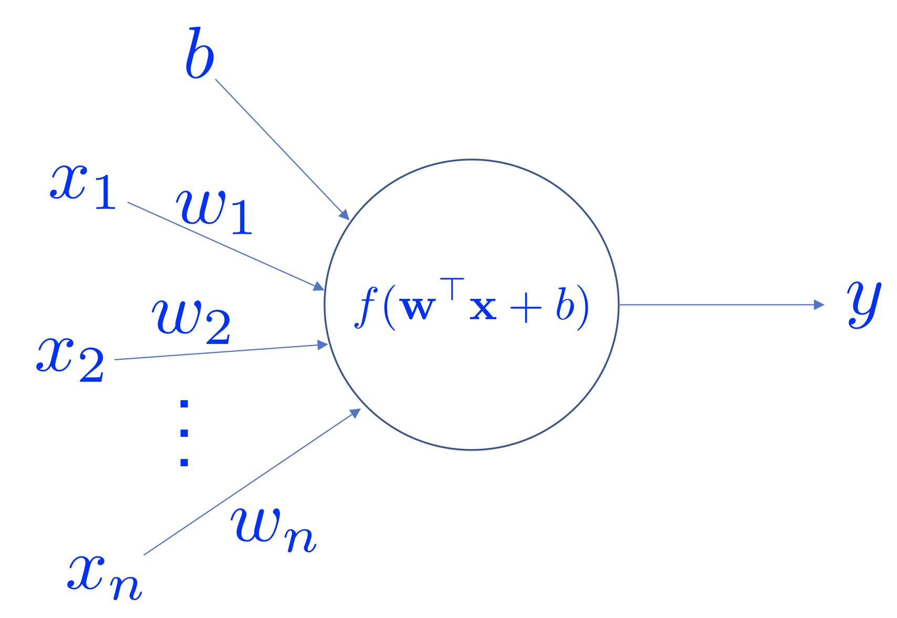

In this session, we are going to learn two types of __Artificial Neural Networks__ (ANNs): Multi-layer Perceptron (MLP) and Convolutional Neural Networks (ConvNets). These ANN architectures are also __Feedforward Networks__ (FNNs). We will show how they works and the links between them. In addition, we will also learn _regularization_ techniques that improve generalization during training.

## Deep Learning: Another Victim of the CS Naming Logic

__Deep Learning__ (DL) is a terrible name. First of all, there is no concrete definition of the term "deep". In the influential review article _Deep Learning in Neural Networks: An Overview_, Schmidhuber says:

---

At which problem depth does _Shallow Learning_ end, and _Deep Learning_ begin? Discussions with DL experts have not yet yielded a conclusive response to this question. Instead of committing myself to a precise answer, let me just define for the purposes of this overview: problems of depth $$>10$$ require Very Deep Learning.

---

__Remark__: We encourage you to check out this fascinating review of Deep Learning.

Instead of the term "deep", "hierarchical" might be more suitable. However, modern (in last two years) DL models cannot simply be characterized by "hierarchical" anymore (e.g., Neural Turning Machine models).

The second part of the name "Learning" is also a misleading word. The "learning" process (via training) intends to improve the generalization in unseen examples. However, the concept does not associate with "learning" in the biological sense. The entire "learning" process is carried out by some powerful optimization algorithms (we called them "training" algorithms).

This is another example where computer scientists gave a terrible yet catchy name (the first example is "Computer Science" itself, check [here](https://ocw.mit.edu/courses/electrical-engineering-and-computer-science/6-001-structure-and-interpretation-of-computer-programs-spring-2005/video-lectures/1a-overview-and-introduction-to-lisp/) for reason). Yann Lecun, one of the founding fathers of DL, proposed to rename "Deep Learning" to "Differentiable
Programming" in a recent [Facebook post](https://www.facebook.com/yann.lecun/posts/10155003011462143). This is by far the most accurate definition. First, all modern DL models up to date are differentiable. And the optimization algorithms finds a set of optimal parameters that "program" the model to exhibit some desired behaviors.

We have to remember that DL consists of many extremely useful and powerful tools. However, DL alone is not AI, or Machine Learning.

__Remark__: To be exact, differentiable models are the largest family of DL models. However, there are DL models that are not differentiable and do not use SGD to optimize (e.g., some Reinforcement Learning algorithms).

## Artificial Neuron

Artificial Neural Networks (ANNs) are machine learning models that are inspired by neuroscience findings and are constructed by a mathematical abstraction of functionality of biological neurons.

---

<div align="center">
    <p></p>
    <p>An artificial neuron.</p>
</div>

---

An artificial neuron receives a vector of input $$\mathbf{x}$$, and the output is determined by the activation function of the _weighted_ sum of the input vector and an optional bias value. Popular choices of activation functions are

$$
\begin{cases}
    \text{sigmoid} & \sigma(z)=\frac{1}{1+\exp(-z}) \\
    \text{tanh} & \tanh(z) = \frac{\exp(z)-\exp(-z)}{\exp(z)+\exp(-z)} \\
    \text{ReLU} & \text{ReLU}(z) = \max(0, z)
\end{cases}
$$

where $$z=\mathbf{w}\mathbf{x}+b$$, ReLU stands for "Rectified Linear Unit". Note that in practice there are more activation functions available (e.g., Leaky ReLU, ELU, softplus).

---

<div align="center">
    <p>
    
    </p>
    <p><b>Left</b>: the Sigmoid function; <b>Middle</b>: the tanh function; <b>Right</b>: the ReLU function.</p>
</div>

---

Sigmoid function was very popular because (a) the function has a range between 0 to 1 so that one can interpret the level of activation to some meaning; (b) the function is more "biological plausible" than other activation functions for our artificial neuron model. However, in practice, Sigmoid function has some very undesirable properties. One of the greatest issues is that the gradient of the neuron reaches to zero when the activation of the neuron saturates at the tails of the function. When the gradient is
close zero, the parameters that is associated with the neuron can not be effectively updated.

$$\tanh$$ is the scaled and shifted version of the Sigmoid function ($$\tanh(x)=2\sigma(2x)-1$$). This function squashes the function input to the range $$(-1, 1)$$. Compared to the Sigmoid function, the $$\tanh$$ function is zero-centered although it still has the saturation problem. In practice, the $$tanh$$ function is always preferred to the Sigmoid function.

ReLU becomes very popular in the last few years after the seminal work _ImageNet Classification with Deep Convolutional Neural Networks_ by Alex Krizhevsky, et al. was published in 2014. The function greatly accelerates the training compared to the Sigmoid or $$\tanh$$ functions. Additionally, ReLU is very cheap to compute. The ReLU function has its own problems as well. For example, a neuron may not be activated by any inputs (e.g., always outputs zero) from the entire
dataset if the neuron experienced a large gradient flow. And because the ReLU is an open-ended function, the training may suffer from instability if the network has too many layers.

__Remarks__: Although ReLU function is the most-common choice of the activation function, Sigmoid or $$\tanh$$ function have their own market of use. In particular, they are preferable in Recurrent Neural Networks (RNNs) where the neuron receives feedback signals.

A group of artificial neurons can be organized into a layer. A layer is the building block of ANNs. Interactions between and within layers shape the dynamics of the neural networks.

## Multi-layer Perceptron

## Convolutional Nerual Networks

Convolutional Neural Networks (ConvNets) are a generalization of MLP networks. The weights of the $$l$$-th convolutional layer can be defined as a 4D tensor where the dimension of the tensor is determined by number of filters $$K_{m}$$, number of channels $$K_{n}$$, the height of the filters $$K_{h}$$ and the width of the filters $$K_{w}$$ (e.g., $$\mathbf{W}^{l}\in\mathbb{R}^{K_{m}\times K_{n}\times K_{h}\times K_{w}}$$). The bias is a 1D tensor where the length is equal
to the number of filters (e.g., $$\mathbf{b}^{l}\in\mathbb{R}^{K_{m}}$$). Let the input feature maps $$\mathbf{F}$$ be a 3D tensor where the dimension is defined as number of feature maps $$N_{f}$$, the height of the feature map $$N_{h}$$ and the width of the feature map $$N_{w}$$ (e.g., $$\mathbf{F}\in\mathbb{R}^{N_{f}\times N_{h}\times N_{w}}$$). Note that the MLP network is a special case when $$N_{h}=N_{w}=1$$.

$$
\begin{aligned}
    \mathbf{z}_{k_{m}}(i,j)&=\left(\mathbf{W}_{k_{m}}^{l}*\mathbf{F}\right)(i,j) \\
    &=\sum_{k_{n}}\sum_{k_{h}}\sum_{k_{w}}\mathbf{F}(k_{h}, k_{w})\mathbf{W}_{k_{m}}^{l}(i-k_{h}, j-k_{w})+b_{k_{m}}^{l} \\
    \mathbf{h}_{k_{m}}^{l}&=f^{l}(\mathbf{z}_{k_{m}})
\end{aligned}
$$

The above equations demonstrate the convolution operation by using the $$k+{m}$$-th filter. The output of the layer $$\mathbf{h}^{l}$$ includes the activations (output feature maps) from all filters $$\{\mathbf{h}_{1}^{l}, \ldots, \mathbf{h}_{K_{m}}^{l}\}$$. Note that the above equations do not include zero-padding and sub-sampling parameters (strides). There are variants of convolution operations according to different parameter settings. Readers can find
a detailed discussion in Goodfellow et al. (2016).

Another important component of ConvNets is pooling. The pooling operation is inspired by the complex cells in the Primary Visual Cortex (V1) (Hubel
& Wiesel, 1962). It serves as a way of sub-sampling and invariance. Max-pooling and average-pooling are notable examples of pooling operations which
are widely applied in Deep Neural Networks. Note that more complicated
pooling operation can be configured by altering its pooling shape, strides, and
zero-padding parameters, e.g., overlapping pooling when pooling strides are
smaller than pooling sub-region shape. A more informative review of pooling
operations can be found in Goodfellow et al. (2016) as well.

ConvNets are largely responsible for the renaissance of neural networks
(Krizhevsky et al., 2012). They have proven to be great architectures for
achieving state-of-the art results on visual recognition tasks, e.g., image and
video recognition (Simonyan & Zisserman, 2014; Szegedy et al., 2015; Ji et al.,
2013), object detection (Ren et al., 2015; Liu et al., 2015) and image caption
generation (Karpathy & Li, 2015; Vinyals et al., 2016). Recent results show
that certain types of ConvNets achieve comparable performance in Natural
Language Processing (NLP) tasks against RNNs (Zhang et al., 2015; Kalchbrenner et al., 2016).

## Regularization

Regularization techniques in DNNs research help to reduce the network generalization error which is the difference between training and testing errors. These
techniques usually bound the weights, stabilize training, and increase robustness against adversarial examples of the network. This section introduces $$L^{2}$$
Regularization and Batch Normalization (BN) (Ioffe & Szegedy, 2015) which
are both applied throughout this thesis. A more informative review of regularization in Deep Learning can be found in Goodfellow et al. (2016).

### $$L^{1}$$ Regularization

### $$L^{2}$$ Regularization

$$L^{2}$$ regularization is commonly referred to as _weight decay_. It has been broadly applied in DNNs in order to control the squared sum of the trainable parameters $$\theta$$. To apply $$L^{2}$$ regularization, one modifies the original cost function $$J$$ to $$\hat{J}$$:

$$
\hat{J}(\theta, \lambda)=J(\theta)+\lambda\|\theta\|_{2}^{2}
$$

where $$\lambda$$ is a small constant that controls the weight decay speed.

### Dropout

### Batch Normalization

Batch Normalization (BN) was proposed as a strategy of reducing internal
covariate shift (Ioffe & Szegedy, 2015). Internal covariate shift is characterized
as “the change in the distribution of network activation due to the change in
network parameters during training”. Mathematically, BN is defined as:

$$
\hat{\mathbf{h}} = \text{BN}(\mathbf{h};\gamma, \beta)=\beta+\gamma\odot\frac{\mathbf{h}-\mathbb{E}[\mathbf{h}]}{\sqrt{\text{Var}[\mathbf{h}]+\varepsilon}}
$$

where the equation takes the layer's output activation $$\mathbf{h}$$ and normalizes it into $$\hat{\mathbf{h}}$$, $$\gamma$$ and $$\beta$$ are trainable parameters that are called scale and shift parameters respectively, and $$\varepsilon$$ is a small regularization constant.

The use of BN in DNNs greatly smooths the network training in practice. It is not used as a default component in many DNNs architectures (e.g., ResNets). The application of BN in RNNs is recently explored in Cooijmans et al. (2016).

## Credit Assignment and the Vanishing Gradient Problem

## Exercises

1. In this exercise, you will need to implement a multi-layer perceptron to classify the images in the [Fashion-MNIST](https://github.com/zalandoresearch/fashion-mnist) dataset into ten classes. As in last week, you will be provided with a [template script](./res/code/mlp-with-keras-layers-template.py) with the barebone structure of the implementation. You will need to complete the script by defining a multi-layer perceptron model with two hidden layers of 100 units each, each with 'relu' activation, using keras layers, compile the model with the categorical cross entropy loss and an optimizer of your choice, and train the model. Note the performance of the model after every epoch and also note the number of parameters in the model.

2. In this exercise, you will need to implement a convolutional neural network to classify the images in the Fashion MNIST dataset into ten classes. You will be provided with a [template script](./res/code/conv-net-with-keras-layers-template.py) with the barebone structure of the implementation. You will need to complete the script by defining a convolutional neural network as described below, using keras layers, compile and train the model as in the above exercise. Compare both the performance of this model and also the number of trainable parameters in this model to the multi-layer perceptron model trained in the above exercise.
```The convolutional neural network has a convolution layer with 20 kernels of size 5x5 each, with a 'relu' activation followed by max pooling with a pool size of (2, 2) and a stride of (2, 2). This is followed by another convolution layer with 50 kernels of size 5x5 each, with a 'relu' activation followed by max pooling with a pool size of (2, 2) and a stride of (2, 2). Now flatten the 2D output from the previous layer and apply a linear transformation to a space with 500 units, with a 'relu' activation, followed by another linear transformation into 10 units. Use a 'softmax' activation on the final layer to train the model as a classifier.```

3. In this exercise, you will need to implement a multi-layer perceptron as in the first exercise, but you will not be using the keras layers but build the model from scratch like in the second exercise from last week. You will have to build a multi-layer perceptron with arbitrary number of layers with arbitrary number of units in each of the layer. You can assume the number of layers is given by a variable num_layers and set it to 2 like in the first exercise, and the number of units in each of the layer can be assumed to be encoded in a list num_units and set it to [100, 100] like in the first exercise. You will have to create the necessary input and target placeholders, create the necessary variables of appropriate shapes, perform the necessary operations as in a multi-layer perceptron, define the loss based on the model prediction and the target, and then define the gradients of the loss with respect to the variables in the model. Then you will have to define the train_function and the test_function like in the last model. You will be provided with a [template script](./res/code/mlp-basic-template.py) to help you with the peripheral script.
